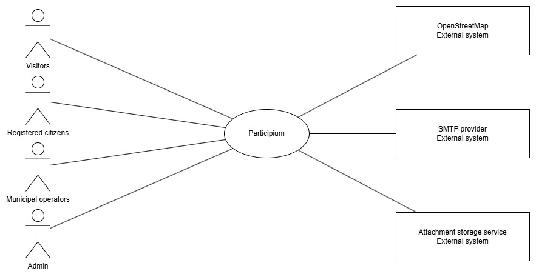

# 1) Stakeholders

| ID     | Type | Stakeholder name | Description | Role | Main concerns |
|:-------|:-----|:-----------------|:------------|:-----|:--------------|
| STK-01 | Organization | Municipality of Turin (Project sponsor) | Organization funding and governing Participium. | Strategic owner. | Transparency, legal compliance, adoption, cost control. |
| STK-02 | User | Visitors | Person who consults public reports without login. | Public audience. | Easy access, trust, clear information. |
| STK-03 | User | Registered citizens | Person who submits and follows reports. | Main operational user group. | Fast submission, privacy, clear updates. |
| STK-04 | User | Municipal operators | Municipal staff who review submissions, manage workflow, and communicate updates. | Triage and execution. | Workload, consistency, traceability. |
| STK-05 | Organization | Municipal privacy/legal office (DPO function) | Internal function overseeing GDPR compliance and privacy governance for municipal digital services. | Compliance governance stakeholder. | Lawful processing, data minimization, retention controls, audit readiness. |
| STK-06 | User | Admin | Person who manages categories, permissions, and analytics. | Platform governance. | Access control, auditability, maintainability. |
| STK-07 | External system | OpenStreetMap service | Service used for map geolocation and rendering. | External dependency. | Availability, API compatibility, performance. |
| STK-08 | External system | Communication and storage/CDN services | Services used for SMTP email delivery, attachment storage, and CDN-based photo delivery. | External dependencies. | Deliverability, storage reliability, CDN availability, continuity. |

Stakeholder priority and influence summary:
- High influence/high priority: STK-01, STK-04, STK-06.
- High priority users: STK-03.
- Critical external dependencies: STK-07, STK-08.

Assumption note: for modeling simplicity, the baseline internal municipal functions (initial verification and technical intervention) are represented as a single actor role, Municipal operators, while preserving the same workflow responsibilities.

---

# 2) Context Diagram

Interaction summary:

| External actor/system | Data/events sent to Participium | Data/events received from Participium |
|:----------------------|:---------------------------------|:--------------------------------------|
| Visitors | Search/filter parameters, map/list navigation actions | Public reports, public statistics, report details (with anonymity rules) |
| Registered citizens | Registration data, new report data, photos, follow/unfollow actions, messages | Account verification status, report tracking data, in-app notifications, optional emails, operator messages |
| Municipal operators | Assignment/rejection decisions, status updates, and citizen messages | Pending reports queue, assigned work items, report details, and status history |
| Admin | Category/user management commands, analytics queries | Private statistics dashboards, export data |
| OpenStreetMap | Map tile/geolocation service responses | Tile/geolocation requests for Turin map interactions |
| SMTP provider | Delivery receipts/bounces (if exposed) | Verification emails, optional notification emails |
| Attachment storage/CDN service | Photo upload requests, file retrieval requests, and CDN asset delivery requests | Stored file references, retrieval responses, and CDN delivery responses for report photos |

---

# 3) Interfaces

| ID    | Interface | Actor       | Physical interface | Logical interface |
|:------|:----------|:------------|:-------------------|:------------------|
| IF-01 | Public portal interface | Visitors | Smartphone/PC with internet connection | Web/mobile GUI |
| IF-02 | Citizen interface | Registered citizens | Smartphone/PC with internet connection | Web/mobile GUI |
| IF-03 | Operator interface | Municipal operators | Smartphone/PC with internet connection | Web/mobile GUI |
| IF-04 | Administration interface | Admin | Smartphone/PC with internet connection | Web/mobile GUI |
| IF-05 | Map service interface | OpenStreetMap service | Internet connection | Map APIs |
| IF-06 | Email service interface | SMTP provider | Internet connection | Email/Notification APIs |
| IF-07 | Attachment storage/CDN interface | Attachment storage/CDN service | Cloud network connection | Cloud storage APIs and CDN delivery endpoints |

Interface rationale:
- The project adopts a single responsive web client (no native mobile app) to remain consistent with Task 1 scope assumptions.
- External interfaces are limited to map rendering/geolocation, email delivery, and attachment storage with CDN delivery support for photo assets, all already assumed in Task 1 scope and infrastructure dependencies.

---

# 4) Personas

| ID     | Name | Role | Background / Context | Goals | Constraints | Devices / Usage setting | Accessibility / Additional needs |
|:-------|:-----|:-----|:---------------------|:------|:------------|:------------------------|:---------------------------------|
| PER-01 | Marco R. | Registered citizen | Office worker who reports issues while commuting. | Quick submission, privacy, status tracking. | Limited time and unstable mobile connection. | Mostly smartphone, sometimes laptop. | Needs short forms and clear feedback. |
| PER-02 | Paolo M. | Municipal operator | Municipal staff member handling initial report review and assignment. | Fast triage and correct routing. | High workload during peak times. | Desktop workstation. | Needs strong filters and compact queues. |
| PER-03 | Sara L. | Municipal operator | Municipal staff member managing intervention updates and citizen communication. | Update status and coordinate clarifications. | Delays from field coordination. | Desktop, occasional tablet. | Needs clear status history and quick messaging. |
| PER-04 | Andrea F. | System administrator | IT administrator managing configuration and analytics. | Manage categories, roles, and private statistics. | Must ensure privacy and continuity. | Desktop browser. | Needs role-based controls and export-ready views. |

---

# 5) User Stories

| ID    | Persona/Role | User story (As a… I want… so that…) |
|:------|:-------------|:------------------------------------|
| US-01 | Citizen | As a citizen, I want to create an account and verify my email so that I can submit reports securely. |
| US-02 | Citizen | As a citizen, I want to submit a geo-located report with title, description, category, and up to 3 photos so that the municipality can understand and handle the issue. |
| US-03 | Citizen | As a citizen, I want to choose anonymity for public views so that I can report issues without exposing my identity publicly. |
| US-04 | Citizen | As a citizen, I want to view the status evolution of my reports so that I can track municipal handling progress. |
| US-05 | Citizen | As a citizen, I want to follow reports and receive updates (in-app and optional email) so that I stay informed. |
| US-06 | Visitor | As a visitor, I want to browse reports on map and table views so that I can understand local urban issues. |
| US-07 | Visitor | As a visitor, I want to filter, sort, and export report data so that I can find and reuse relevant information. |
| US-08 | Visitor | As a visitor, I want to view public statistics by category and time so that I can understand issue trends in the city. |
| US-09 | Municipal Operator | As a municipal operator, I want to review incoming reports and assign them to competent offices so that handling starts quickly and correctly. |
| US-10 | Municipal Operator | As a municipal operator, I want to reject invalid reports with motivation so that citizens receive clear feedback and data quality remains high. |
| US-11 | Municipal Operator | As a municipal operator, I want to update report status (Assigned, In Progress, Suspended, Resolved) so that report progress is transparent. |
| US-12 | Municipal Operator | As a municipal operator, I want to exchange direct messages with citizens so that I can request clarifications and provide updates. |
| US-13 | Admin | As an admin, I want to manage categories so that reports are classified consistently. |
| US-14 | Admin | As an admin, I want to manage permissions and view analytics (public and private) so that operations stay controlled and measurable. |

---

# 6) Functional Requirements (FR)

| ID    | Requirement statement (The system shall…) | Priority | User story ID | Notes |
|:------|:------------------------------------------|:---------|:--------------|:------|
| FR-01 | The system shall provide means for account and profile management. | Critical | US-01, US-05 | Parent requirement group. |
| FR-01.1 | The system shall allow users to register and verify email before report submission. | Critical | US-01 | Account creation and activation. |
| FR-01.2 | The system shall allow citizens to set profile notification preferences (in-app and optional email). | Important | US-05 | Notification preference management. |
| FR-01.3 | The system shall allow authenticated citizens to manage their profile data (at minimum: username, first name, and last name). | Important | US-01 | Baseline profile data management. |
| FR-01.4 | The system shall allow citizens to upload, replace, or remove an optional profile picture. | Optional | US-01 | Optional profile media management. |
| FR-02 | The system shall provide means to submit and consult reports. | Critical | US-02, US-06, US-07 | Parent requirement group. |
| FR-02.1 | The system shall allow authenticated citizens to create reports with title, description, category, geolocation, and up to 3 photos. | Critical | US-02 | Core report creation flow. |
| FR-02.2 | The system shall allow citizens to mark reporter identity as anonymous in public views. | Critical | US-03 | Public anonymity option. |
| FR-02.3 | The system shall provide public map and detail views of published reports. | Critical | US-04, US-06 | Public consultation capability. |
| FR-02.4 | The system shall provide table consultation with filters by category, status, period, and sorting by relevant fields. | Critical | US-07 | Structured consultation capability. |
| FR-02.5 | The system shall export filtered table results in CSV format. | Important | US-07 | Transparency and offline analysis. |
| FR-03 | The system shall provide means for report workflow and communication. | Critical | US-09, US-10, US-11, US-12 | Parent requirement group. |
| FR-03.1 | The system shall manage report status using the finite set: Pending Approval, Assigned, In Progress, Suspended, Rejected, Resolved. | Critical | US-11 | Baseline status model. |
| FR-03.2 | The system shall allow municipal operators to review pending reports, assign valid ones, and reject invalid ones with explicit motivation. | Critical | US-09, US-10 | Triage and decision process. |
| FR-03.3 | The system shall allow municipal operators to update status and add progress notes during handling. | Critical | US-11 | Operational progress management. |
| FR-03.4 | The system shall support direct messaging between citizens and operators linked to report context. | Critical | US-12 | Clarification and feedback channel. |
| FR-03.5 | The system shall allow citizens to follow/unfollow reports and receive updates in-app and by optional email. | Critical | US-05 | Follow and notification flow. |
| FR-03.6 | The system shall enforce that report messaging threads are accessible only to the reporting citizen, authorized municipal operators, and administrators according to role permissions. | Critical | US-12, US-14 | Messaging privacy and access control. |
| FR-04 | The system shall provide means for administration and analytics. | Critical | US-13, US-14 | Parent requirement group. |
| FR-04.1 | The system shall allow administrators to manage report categories. | Important | US-13 | Category governance. |
| FR-04.2 | The system shall provide private statistics to administrators, including breakdowns by status, type, and reporter. | Important | US-14 | Restricted analytics. |
| FR-04.3 | The system shall enforce role-based permissions and restrict administrative features to authorized users. | Critical | US-14 | Access control model. |
| FR-04.4 | The system shall provide public statistics by category and time trend (day/week/month). | Important | US-08 | Public transparency analytics. |
| FR-04.5 | The system shall keep reporter identity internally available to authorized municipal staff when public anonymity is enabled. | Critical | US-03, US-09 | Legal and operational accountability. |
| FR-04.6 | The system shall apply privacy safeguards in private analytics views by limiting reporter-level outputs to authorized administrators and masking or aggregating low-frequency result sets according to configured thresholds. | Important | US-14 | Privacy-preserving analytics controls. |

---

# 7) Non-Functional Requirements (NFR)

| ID     | Category | Requirement statement | Metric / Target | Verification                           | Priority | Notes |
|:-------|:---------|:----------------------|:----------------|:---------------------------------------|:---------|:------|
| NFR-01 | Efficiency | The system shall return standard page/API responses for common operations within acceptable latency under normal load. | 95th percentile response time <= 2 seconds for read operations; <= 3 seconds for report submission excluding photo upload time. | Load/performance test and monitoring dashboard review. | Critical | Baseline perceived responsiveness for web users. |
| NFR-02 | Efficiency | The map view shall become interactable quickly for users on typical broadband/mobile networks. | Initial map render <= 5 seconds at 95th percentile in target region. | Synthetic monitoring and browser performance tests. | Critical | Depends on external map tile service behavior. |
| NFR-03 | Reliability | The service shall be available to public users and municipal operators with limited downtime. | Monthly uptime >= 99.5% excluding planned maintenance windows. | Operational log inspection and uptime monitoring. | Important | Public-service continuity target. |
| NFR-04 | Reliability | Data modifications for reports, messages, and status updates shall be durable and recoverable after failures. | Recovery point objective (RPO) <= 24h; recovery time objective (RTO) <= 8h. | Backup/restore drills and disaster recovery test reports. | Critical | Consistent with Task 1 backup assumptions. |
| NFR-05 | Security | The system shall protect authentication credentials and sessions using current security practices. | Passwords hashed with Argon2id (or equivalent adaptive hashing); TLS 1.2+ enforced for authenticated traffic; session idle timeout <= 30 minutes and absolute session lifetime <= 24 hours. | Security inspection, configuration review, and penetration-test checklist. | Critical | Protects user identity and access. |
| NFR-06 | Privacy/Compliance | The system shall process personal data according to data minimization and purpose limitation principles. | Only required profile attributes stored; anonymity option active in public views; data-retention rules documented per data type; account data deletion requests fulfilled within <= 30 calendar days. | Compliance inspection, data-model review, and periodic deletion-process audit. | Critical | GDPR-oriented requirement. |
| NFR-07 | Authorization | Privileged features shall be accessible only to authorized roles. | 100% of tested protected endpoints reject unauthorized access attempts. | Authorization test suite and manual security testing. | Critical | Supports role model in FR-04.3. |
| NFR-08 | Usability | The report submission flow shall be simple enough for occasional users. | Median completion time <= 2 minutes for successful submissions in representative usability tests. | Moderated usability testing and task-timing analysis. | Critical | Matches PER-01 constraints. |
| NFR-09 | Accessibility | Core public and citizen workflows shall be accessible to users with common visual/motor needs. | Conformance with WCAG 2.1 level AA for key pages. | Accessibility audit (automated + manual inspection). | Important | Inclusive public-service usage. |
| NFR-10 | Maintainability | The codebase shall remain understandable and testable for handover and evolution. | Minimum 70% unit/integration coverage on backend core modules; architecture/API docs updated per release. | CI quality gate and documentation review. | Important | Practical threshold for student project constraints. |