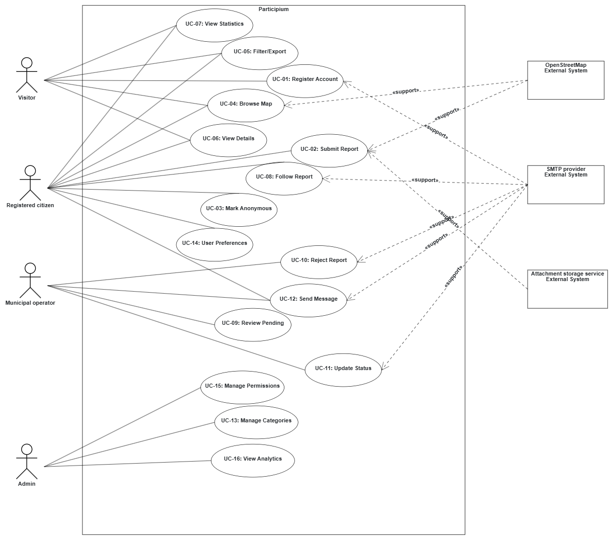

# 1) Use Case Diagram

**Diagram Description:**
The use case diagram shows the Participium system boundary with 4 user actors (Visitors, Registered citizens, Municipal operators, Admin) and 3 external systems (OpenStreetMap, SMTP provider, Attachment storage/CDN service). The 16 use cases are organized by functional area: account management (UC-01, UC-14), report submission and anonymity (UC-02, UC-03), public report consultation (UC-04, UC-05, UC-06, UC-07), report workflow for operators (UC-09, UC-10, UC-11, UC-12), citizen engagement (UC-08, UC-12), and administrative functions (UC-13, UC-15, UC-16).

Assumption note: to keep the use case model compact and readable, verification and technical municipal office responsibilities are represented by one actor, Municipal operators.

JSON source file location: `../../data/use-case-diagram.json`

---

# 2) Use Case Narratives

## UC-01: Register Account and Verify Email

| Use Case | Register Account and Verify Email |
|:---------|:----------------------------------|
| ID | UC-01 |
| Scope | Participium system |
| Level | User goal |
| Intention in Context | Visitor wants to create an account and verify email. |
| Primary actor | Visitor (prospective citizen) |
| Supporting actors | SMTP provider |
| Stakeholders' interests | Citizens want easy signup; municipality wants verified contacts. |
| Precondition | Visitor is not registered. |
| Minimum guarantees | No active account is created on failure. |
| Success guarantees | Verified citizen account is active. |
| Trigger | Visitor clicks "Register" or "Create account" on the public portal. |
| Main success scenario | 1. Visitor opens registration form. 2. Visitor enters required data. 3. System validates data and sends verification email. 4. Visitor clicks verification link. 5. System activates account. The use case terminates with success. |
| Extensions | 2a. Invalid data: system shows error and asks correction. 3a. Email not delivered: system retries and allows resend. 4a. Expired link: system asks for new verification email. |

---

## UC-02: Submit Geo-located Report

| Use Case | Submit Geo-located Report |
|:---------|:--------------------------|
| ID | UC-02 |
| Scope | Participium system |
| Level | User goal |
| Intention in Context | Citizen wants to report an urban issue with location and evidence. |
| Primary actor | Registered citizen |
| Supporting actors | OpenStreetMap, Attachment storage/CDN service |
| Stakeholders' interests | Citizens want fast submission; operators want complete report data. |
| Precondition | Citizen is logged in and verified. |
| Minimum guarantees | No report is created if submission fails. |
| Success guarantees | New report is stored as Pending Approval with unique ID. |
| Trigger | Citizen navigates to "New Report" page or clicks "Create Report" button in citizen portal. |
| Main success scenario | 1. Citizen opens new report page. 2. Citizen selects map location and category. 3. Citizen enters title and description. 4. Citizen uploads up to 3 photos. 5. Citizen submits report. 6. System stores report and shows report ID. The use case terminates with success. |
| Extensions | 4a. Invalid photo/size: system rejects file and asks retry. 5a. Missing required fields: system shows validation errors. 5b. Connection lost: system asks user to retry submission. |

---

## UC-03: Mark Report as Anonymous

| Use Case | Mark Report as Anonymous |
|:---------|:------------------------|
| ID | UC-03 |
| Scope | Participium system |
| Level | User goal |
| Intention in Context | Citizen wants to hide identity in public views. |
| Primary actor | Registered citizen |
| Supporting actors | None |
| Stakeholders' interests | Citizens want privacy; municipality keeps internal traceability. |
| Precondition | Citizen is in report submission flow. |
| Minimum guarantees | Default is non-anonymous if option is not selected. |
| Success guarantees | Report is saved with anonymity flag and name is hidden publicly. |
| Trigger | Citizen sees checkbox or toggle labeled "Make this report anonymous in public views" on the report review page before final submission. |
| Main success scenario | 1. Citizen reviews report before submit. 2. Citizen enables anonymity option. 3. Citizen submits report. 4. System stores report as anonymous for public views. The use case terminates with success. |
| Extensions | 2a. Citizen disables anonymity: report is public with reporter name. 3a. Metadata risk in images: system strips EXIF on upload. |

---

## UC-04: Browse Reports on Map

| Use Case | Browse Reports on Map |
|:---------|:----------------------|
| ID | UC-04 |
| Scope | Participium system |
| Level | User goal |
| Intention in Context | User wants to view published reports on an interactive map. |
| Primary actor | Visitor or Registered citizen |
| Supporting actors | OpenStreetMap |
| Stakeholders' interests | Public users want easy exploration; municipality wants transparency. |
| Precondition | User can access portal and map service is available. |
| Minimum guarantees | If map fails, user still has table view. |
| Success guarantees | Published reports are shown as map markers. |
| Trigger | User navigates to "Browse Reports" or "Home" page and selects "Map View" tab. |
| Main success scenario | 1. System loads city map. 2. System shows published report markers. 3. User zooms/pans and selects a marker. 4. System shows preview and opens details on request. The use case terminates with success. |
| Extensions | 1a. Map provider slow: system retries and uses cache. 2a. No published reports: system shows empty-map message. |

---

## UC-05: Filter, Sort, and Export Reports in Table

| Use Case | Filter, Sort, and Export Reports in Table |
|:---------|:-----------------------------------------|
| ID | UC-05 |
| Scope | Participium system |
| Level | User goal |
| Intention in Context | User wants to query reports in table form and export results. |
| Primary actor | Visitor or Registered citizen |
| Supporting actors | None |
| Stakeholders' interests | Users want transparent data access; municipality wants auditable access. |
| Precondition | User is on browse page. |
| Minimum guarantees | Table view remains available if export fails. |
| Success guarantees | User filters/sorts reports and exports CSV. |
| Trigger | User navigates to "Browse Reports" tab and selects "Table View" or user wants to refine map results. |
| Main success scenario | 1. System shows report table and filters. 2. User applies filters and sorting. 3. System refreshes results. 4. User exports CSV. The use case terminates with success. |
| Extensions | 2a. No matches: system shows empty results message. 4a. Export interrupted: system shows error and allows retry. |

---

## UC-06: View Report Details

| Use Case | View Report Details |
|:---------|:-------------------|
| ID | UC-06 |
| Scope | Participium system |
| Level | User goal |
| Intention in Context | User wants full report information and status history. |
| Primary actor | Visitor or Registered citizen |
| Supporting actors | (None directly; may transition to UC-08 or UC-12) |
| Stakeholders' interests | Public users want clarity; municipality wants transparency. |
| Precondition | User selected a report and has access permission. |
| Minimum guarantees | Read-only access remains available for allowed users. |
| Success guarantees | Full report details are displayed. |
| Trigger | User clicks "View Details" from map marker preview or table row. |
| Main success scenario | 1. System loads report by ID and checks access. 2. System shows report fields, media, and status history. 3. User reads details and may continue to follow/message actions. The use case terminates with success. |
| Extensions | 1a. Report unavailable or forbidden: system shows access error. 2a. Large media: system shows thumbnails first. |

---

## UC-07: View Public Statistics

| Use Case | View Public Statistics |
|:---------|:----------------------|
| ID | UC-07 |
| Scope | Participium system |
| Level | User goal |
| Intention in Context | User wants aggregated public statistics on reports. |
| Primary actor | Visitor or Registered citizen |
| Supporting actors | None |
| Stakeholders' interests | Citizens and visitors want transparency; municipality wants accountability. |
| Precondition | Statistics dashboard is available. |
| Minimum guarantees | Cached data can be shown if live query is slow. |
| Success guarantees | Aggregated charts/tables are displayed. |
| Trigger | User navigates to "Statistics" or "Dashboard" tab on public portal. |
| Main success scenario | 1. System aggregates published reports. 2. System shows category, status, and trend charts. 3. User changes time range/filter. 4. System refreshes metrics. The use case terminates with success. |
| Extensions | 3a. Custom range selected: system recalculates charts. 4a. Very small dataset: system shows low-significance warning. |

---

## UC-08: Follow/Unfollow Report

| Use Case | Follow/Unfollow Report |
|:---------|:----------------------|
| ID | UC-08 |
| Scope | Participium system |
| Level | User goal |
| Intention in Context | Citizen wants to subscribe/unsubscribe to report updates. |
| Primary actor | Registered citizen |
| Supporting actors | SMTP provider |
| Stakeholders' interests | Citizens want updates; municipality wants engagement traceability. |
| Precondition | Citizen is logged in on report detail page. |
| Minimum guarantees | No duplicate follow is created on repeated clicks. |
| Success guarantees | Follow state is updated and notifications follow preferences. |
| Trigger | Citizen clicks "Follow this report" or "Unfollow" button on report detail page (UC-06). |
| Main success scenario | 1. Citizen opens report details. 2. Citizen clicks Follow. 3. System saves subscription and confirms action. 4. On status changes, system notifies citizen based on preferences. 5. Citizen can click Unfollow later. The use case terminates with success. |
| Extensions | 2a. Already following: system toggles to unfollow. 4a. Email delivery fails: in-app notification is still sent. |

---

## UC-09: Review Pending Reports

| Use Case | Review Pending Reports |
|:---------|:----------------------|
| ID | UC-09 |
| Scope | Participium system |
| Level | User goal |
| Intention in Context | Municipal operator wants to triage pending reports. |
| Primary actor | Municipal operator |
| Supporting actors | None |
| Stakeholders' interests | Municipality wants correct triage; citizens want timely decisions. |
| Precondition | Operator is authenticated and pending reports exist. |
| Minimum guarantees | Report remains pending if no action is confirmed. |
| Success guarantees | Report is assigned or rejected with recorded decision. |
| Trigger | Municipal operator logs in and navigates to "Pending Reports" or "Queue" section in operator portal. |
| Main success scenario | 1. System shows pending queue. 2. Operator opens one report and reviews data. 3. Operator chooses Assign or Reject. 4. System stores decision, updates status, and sends notifications. The use case terminates with success. |
| Extensions | 3a. Unsure assignment: operator flags report for senior review. 4a. Anonymous citizen: notification is in-app only. |

---

## UC-10: Reject Report with Motivation

| Use Case | Reject Report with Motivation |
|:---------|:------------------------------|
| ID | UC-10 |
| Scope | Participium system |
| Level | User goal |
| Intention in Context | Operator wants to reject a report with a clear reason. |
| Primary actor | Municipal operator |
| Supporting actors | SMTP provider |
| Stakeholders' interests | Citizens want understandable feedback; municipality wants audit trail. |
| Precondition | Operator is reviewing a pending report. |
| Minimum guarantees | No status change if rejection is cancelled. |
| Success guarantees | Rejection reason is stored and citizen is notified. |
| Trigger | Municipal operator selects "Reject" option while reviewing a report (UC-09). |
| Main success scenario | 1. Operator opens rejection dialog. 2. Operator selects reason and optional comment. 3. Operator confirms rejection. 4. System sets status to Rejected, stores reason, and notifies citizen. The use case terminates with success. |
| Extensions | 4a. Email fails: system retries and keeps in-app notification. 2a. No reason selected: system blocks confirmation. |

---

## UC-11: Update Report Status

| Use Case | Update Report Status |
|:---------|:-------------------|
| ID | UC-11 |
| Scope | Participium system |
| Level | User goal |
| Intention in Context | Municipal operator wants to update progress status of assigned reports. |
| Primary actor | Municipal operator |
| Supporting actors | SMTP provider |
| Stakeholders' interests | Operators want quick updates; citizens want timely visibility. |
| Precondition | Operator is logged in and report is assigned. |
| Minimum guarantees | No duplicate status event on retry. |
| Success guarantees | New status is saved and notifications are sent. |
| Trigger | Municipal operator opens an assigned report and clicks "Update Status" or selects new status from dropdown. |
| Main success scenario | 1. Operator opens assigned report. 2. Operator selects new status and optional note. 3. Operator confirms update. 4. System stores change in history and notifies citizen/followers. The use case terminates with success. |
| Extensions | 2a. Same status selected: system reports no change. 2b. Suspended status: system requires a reason note. |

---

## UC-12: Message with Citizen

| Use Case | Message with Citizen |
|:---------|:-------------------|
| ID | UC-12 |
| Scope | Participium system |
| Level | User goal |
| Intention in Context | Citizen and municipal operator want report-related messaging. |
| Primary actor | Registered citizen or Municipal operator |
| Supporting actors | SMTP provider |
| Stakeholders' interests | Citizens and operators want clear communication; municipality wants message history. |
| Precondition | Both users are authorized to access the same report thread according to role permissions. |
| Minimum guarantees | No duplicate message on retry. |
| Success guarantees | Message is stored and notification is sent. |
| Trigger | Operator or citizen clicks "Message" or "Contact" button in report detail view. |
| Main success scenario | 1. User opens report messages. 2. User writes and sends message. 3. System stores message and updates thread. 4. System notifies the other party. The use case terminates with success. |
| Extensions | 2a. Message too long: system asks user to shorten text. 4a. Recipient offline: message is stored and delivered on next login. |

---

## UC-13: Manage Report Categories

| Use Case | Manage Report Categories |
|:---------|:--------------------------|
| ID | UC-13 |
| Scope | Participium system |
| Level | User goal |
| Intention in Context | Admin wants to create and maintain report categories. |
| Primary actor | Admin |
| Supporting actors | None |
| Stakeholders' interests | Admins/operators want consistent classification; citizens want simple category choices. |
| Precondition | Admin is authenticated. |
| Minimum guarantees | No partial category updates on failure. |
| Success guarantees | Categories are added/edited/deactivated correctly. |
| Trigger | Admin navigates to "Settings" or "Administration" section and selects "Manage Categories". |
| Main success scenario | 1. System shows category list. 2. Admin adds or edits a category. 3. System validates and saves changes. 4. Updated list is available in report submission. The use case terminates with success. |
| Extensions | 2a. Duplicate category name: system shows error. 3a. Category with history cannot be hard-deleted: system enforces deactivation. |

---

## UC-14: Set Notification Preferences

| Use Case | Set Notification Preferences |
|:---------|:------------------------------|
| ID | UC-14 |
| Scope | Participium system |
| Level | User goal |
| Intention in Context | Citizen wants to configure notification channels and profile preferences. |
| Primary actor | Registered citizen |
| Supporting actors | None |
| Stakeholders' interests | Citizens want control; municipality wants fewer unnecessary emails. |
| Precondition | Citizen is logged in. |
| Minimum guarantees | Default preferences remain if user cancels changes. |
| Success guarantees | New notification and profile preferences are saved and applied. |
| Trigger | Citizen navigates to "Settings" or "Preferences" in citizen portal. |
| Main success scenario | 1. Citizen opens preferences page. 2. Citizen selects in-app/email options. 3. Citizen may update profile fields and optional profile picture. 4. Citizen saves changes. 5. System confirms and applies new settings. The use case terminates with success. |
| Extensions | 2a. User disables all channels: system shows warning before saving. 3a. Invalid profile picture format/size: system rejects upload and asks retry. |

---

## UC-15: Manage User Permissions

| Use Case | Manage User Permissions |
|:---------|:------------------------|
| ID | UC-15 |
| Scope | Participium system |
| Level | User goal |
| Intention in Context | Admin wants to assign roles and manage municipal user access. |
| Primary actor | Admin |
| Supporting actors | None |
| Stakeholders' interests | Municipality wants controlled access; admins want auditability. |
| Precondition | Admin is authenticated with permission rights. |
| Minimum guarantees | Existing roles stay unchanged on failed save. |
| Success guarantees | User role/status updates are saved and audited. |
| Trigger | Admin navigates to "Users" under Administration section. |
| Main success scenario | 1. System shows users and current roles. 2. Admin adds or edits a user role. 3. Admin may activate/deactivate accounts. 4. System saves changes and logs audit event. The use case terminates with success. |
| Extensions | 2a. Admin role assignment: system asks extra confirmation. 3a. Deactivated user has active sessions: system forces logout. |

---

## UC-16: View Admin Analytics

| Use Case | View Admin Analytics |
|:---------|:--------------------|
| ID | UC-16 |
| Scope | Participium system |
| Level | User goal |
| Intention in Context | Admin wants private analytics for operations and performance. |
| Primary actor | Admin |
| Supporting actors | None |
| Stakeholders' interests | Admins want insight; municipality wants KPI visibility with restricted access and privacy safeguards. |
| Precondition | Admin is logged in with analytics permission. |
| Minimum guarantees | Cached data is shown if live analytics are slow. |
| Success guarantees | Dashboard metrics are displayed and exportable. |
| Trigger | Admin navigates to "Analytics" or "Dashboard" in admin portal. |
| Main success scenario | 1. System opens private analytics dashboard. 2. Admin chooses time range and views KPIs (volume, status, operator performance, system health). 3. System applies configured privacy safeguards (for example, masking/aggregation for low-frequency reporter-level outputs). 4. Admin exports data if needed. 5. Dashboard refreshes with latest metrics. The use case terminates with success. |
| Extensions | 3a. Large export: system queues async export and provides later download. 4a. Performance issue detected: system shows operational alert. |

---

# 3) Traceability Table

| UC ID | REQ ID | User Story |
|:------|:-------|:-----------|
| UC-01 | FR-01.1 | US-01 |
| UC-02 | FR-02.1 | US-02 |
| UC-03 | FR-02.2 | US-03 |
| UC-03 | FR-04.5 | US-03 |
| UC-04 | FR-02.3 | US-06 |
| UC-05 | FR-02.4 | US-07 |
| UC-05 | FR-02.5 | US-07 |
| UC-06 | FR-02.3 | US-04 |
| UC-06 | FR-02.3 | US-06 |
| UC-07 | FR-04.4 | US-08 |
| UC-08 | FR-03.5 | US-05 |
| UC-09 | FR-03.2 | US-09 |
| UC-09 | FR-04.5 | US-09 |
| UC-10 | FR-03.2 | US-10 |
| UC-11 | FR-03.1 | US-11 |
| UC-11 | FR-03.3 | US-11 |
| UC-12 | FR-03.4 | US-12 |
| UC-12 | FR-03.6 | US-12 |
| UC-13 | FR-04.1 | US-13 |
| UC-14 | FR-01.2 | US-05 |
| UC-14 | FR-01.3 | US-01 |
| UC-14 | FR-01.4 | US-01 |
| UC-15 | FR-04.3 | US-14 |
| UC-16 | FR-04.2 | US-14 |
| UC-16 | FR-04.6 | US-14 |

---

## Traceability Coverage Summary

**Functional Requirements Coverage:**
- FR-01 (Account & profile): UC-01, UC-14, UC-15
- FR-01.1 (Register & verify): UC-01
- FR-01.2 (Notification preferences): UC-14
- FR-01.3 (Profile data management): UC-14
- FR-01.4 (Optional profile picture): UC-14
- FR-02 (Submit & consult): UC-02 through UC-06
- FR-02.1 (Create reports): UC-02
- FR-02.2 (Anonymous option): UC-03
- FR-02.3 (Map & detail views): UC-04, UC-06
- FR-02.4 (Table with filters): UC-05
- FR-02.5 (CSV export): UC-05
- FR-03 (Workflow & communication): UC-09 through UC-12
- FR-03.1 (Status management): UC-11
- FR-03.2 (Review & assign): UC-09, UC-10
- FR-03.3 (Operator update): UC-11
- FR-03.4 (Messaging): UC-12
- FR-03.5 (Follow & notify): UC-08, UC-14
- FR-03.6 (Messaging access control): UC-12
- FR-04 (Admin & analytics): UC-13, UC-15, UC-16
- FR-04.1 (Manage categories): UC-13
- FR-04.2 (Private analytics): UC-16
- FR-04.3 (Role-based permissions): UC-15
- FR-04.4 (Public statistics): UC-07
- FR-04.5 (Internal identity): UC-03, UC-09
- FR-04.6 (Privacy safeguards in analytics): UC-16

**User Stories Coverage:**
- US-01 (Register account): UC-01
- US-02 (Submit report): UC-02
- US-03 (Anonymous): UC-03
- US-04 (View status): UC-05, UC-06
- US-05 (Follow reports): UC-08, UC-14
- US-06 (Browse reports): UC-04, UC-05, UC-06
- US-07 (Filter/sort/export): UC-05
- US-08 (View statistics): UC-07
- US-09 (Review reports): UC-09
- US-10 (Reject reports): UC-10
- US-11 (Update status): UC-11
- US-12 (Message citizens): UC-12
- US-13 (Manage categories): UC-13
- US-14 (Manage permissions & analytics): UC-15, UC-16

**Coverage: 100% of FR items (25/25), 100% of User Stories (14/14), 16 use cases with complete narratives.**
